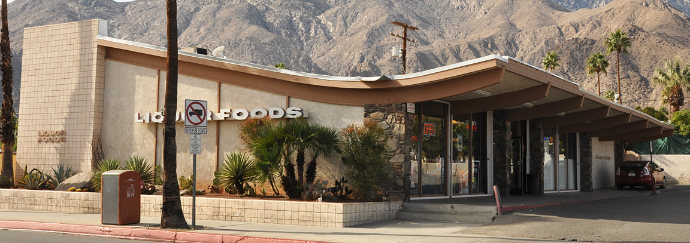

+++
fragment = "content"
categories = ["Travel", "Biography"]
title = "Extraordinary Rendition"
display_date = true
date = "2020-12-05"
weight= 100
katex = false

summary = """

This is the story about the time I went out for coffee and never made it back home. There was a car crash, an arrest, a kidnapping (of sorts), an inglorious exit, and a new beginning.

"""

[sidebar]
  align = "right"

[asset]
  image = "godfather.jpg"

+++

In this tale, we travel back in time to June, 1992. I am 15 years old. My brother, Elijah, is 19. He came over to the house I shared with our mother in Sebastopol, California early one afternoon. We went to the video store to pick out something to watch. Returning to my house with six VHS tapes, the plan was to watch The Godfather I, II, & III consecutively. Binge watching, before it was cool.

It goes without saying that the last three hours were rather disappointing. Not only were we a bit bored, but also hungry and suffering from that existential angst one feels when you realize that you just wasted one of your few days left on Earth.

Elijah, always dissatisfied with his current state back in the day, thought we should go get a triple espresso and a late dinner. We hopped in his car, our father's old Thunderbird, and went off for refreshments. We lived in a rural area so it was an eight mile trip to the highway where you could get food and coffee at 2200.

After we ate, Elijah, always more spontaneous than myself said, "Lets go to Palm Springs for breakfast."

No big deal, it's just an eight hour drive, and we are already on the highway, right?

Elijah is hilarious and with few exceptions, he is an excellent travelling companion. We rolled down the road at ludicrous speed playing Body Count (Ice T's medal band) on the cassette deck.



We showed up for breakfast at our grandparents home in Palm Springs around 0630. They lived in a gated mobile home park. We snuck in behind a gardner's truck and arrived at their front door. Grandpa Lou answered our knock directly and, a bit overwhelmed, started laughing and didn't stop for a minute or two. The precious old guy was really happy to see us.

We caught up on our various stories and had bagels with smoked fish and red onions. Delicious. Then, we crashed. Long frickin' night!

---

Elijah and I grew up in Palm Springs. We had returned to the friends, memories, and patterns of behavior we had left behind. I went off to visit my long time friend, Avram (pseudonym). We met in Mrs. Larabee's class at Palm Valley School in 1982. I had the pleasure to catch up with his parents and siblings as well. I spent a lot of time at their home as a child and it was great to see them.

I recall being taken aback by the gambling addiction Avram had acquired since I left town. He went out of his way to thank me for teaching him how to hijack the phone system to make calls on other people's phones from outside their home. This was something I figured out how to do because of curiosity sparked by having found a pile of used phone systems in a dumpster. He was using the knowledge to engage in some sort of fraud scheme to raise money for his gambling. What the hell happened in the 18 months I had been gone? I was rather glad to have moved away, actually.

His family had some event at their temple to attend that evening so I had to split after a few hours. I tracked down Elijah with his old friend Ryan. I asked if he could come pick me up. He obliged.

He rolled up a bit later, not in his Thunderbird, but in Grandma's Ford LTD Wagon. Within a mile or two I had come to the conclusion that he was drunk as a skunk. He had had a drinking problem for at least a few years (potentially many more than that) by the time he as 19. In fact, he had recently totalled his pick up truck which is why he was driving the Thunderbird. Anyway, he was quite a dangerous drinker and rather obstinate after he hit his limit. Knowing better than to make a fuss, I waited till we were stopped a red light and I jumped out of the car. "See ya", I said.

Affronted, he did his best to make the LTD Wagon look and sound angry as he made his left turn onto Vista Chino without me. Wise decision, I thought.

Thankfully, true to my grandmother's training, I had a quarter in my pocket and called my grandparents for a ride. I hung out in this liquor store's parking lot and waited.

> Palm Springs has some beautiful architecture. Even the corner stores were something to look at!

I felt obliged to lie to Grandpa about the circumstances of how I ended up at Germain Brothers Liquor. Ratting out my brother seemed a poor choice since there were no reasonable interventions that could have been taken. I spent the evening with my grandparents. We had supper, watched the *The MacNeil/Lehrer NewsHour*, and went to bed early. The phone rang in the wee hours of the morning. Elijah was in the custody of some authority under suspicion of driving under the influence.

My grandfather was apoplectic. I had heard rumors of his furious anger but, until that night, I had never experienced it. One memorable story about his temper was told to me by Marshall, the man who presided over my parents marriage ceremony. Marshall was a young man at the time and had been offered a job at my grandparent's small shoe factory in Los Angeles. Just as he arrived at the loading dock of the factory for his first day, the back door was kicked open by a small man was carrying another by his shirt collar and belt. The smaller man tossed the larger off the dock and said, "And don't come back!", then continuing he said to Marshall, "You must be Marshall. Welcome to El Rey of Hollywood. Come on in!"

This was how Marshall was introduced to my Grandfather. I was introduced to that version of him this evening. I did not like it. Grandpa called my father who went into crisis mode (a favorite of his). I was not involved in his planning.

In the morning, the house was cast with a pall. I overheard that the wagon had been moderately damaged during a brief police chase only a few blocks from home and that it was not road worthy. While it was still morning, Simon showed up with Elijah and a tall, crew cut guy with a marshal air. Simon was my father's lawyer and friend. He was able to extricate Elijah from custody. I did not actually see the other guy until a few moments later when he pulled the Thunderbird around to the front of my grandparent's coach. Who the heck is in Elijah's car, I was thinking?



After a brief and private conversation between Simon and my grandfather we were directed into the car. There was no introduction to the mystery man. No goodbyes either. We were, as they say, shown the door.

He headed directly to Interstate 10 and headed east. Home was north by northwest.

Alarmed, I asked the guy, "Where we were going?"

Nothing.

"Who are you?"

Nothing.

"When will we arrive?"

He finally responded, "Shut it or you can ride in the trunk."

He had an unusual accent.

A few hundred miles into the journey, and already into the next state, we pulled over for gas. "Stay in the car", he said.

I made some lame argument about food or thirst. He tossed some jerky and a wide mouthed water bottle from a supply of provisions he brought with him in the front seat.

"We are not stopping again," he said. "If you need to, piss in the bottle."

I drank less.

Around 1900 we pulled off the freeway in Tucson, Arizona. I guessed this was our likely destination as this was where my father had moved a few years earlier. He was standing in front of the apartment complex where he lived when we arrived. I got out of the car a bit bewildered but otherwise fine. Elijah, having slept through the extraordinary rendition, seemed more interested in food and sleep than geography.

The driver walked off, never to be seen again. I asked my father who the guy was. He said, "An Israeli mercenary."

"Where did you find him and how did he get to Palm Springs so fast?"

I received that look reserved for children who ask stupid questions too obvious to answer. Apparently, to my dad, having ready access to men who will fly to another state, put your children in the trunk, and drive 600 miles with them without a word is totally normal. Even 30 years later, with the power of the Internet, I have no idea how to acquire this particular service. Do you?

I never returned home again. My credit report is still blemished with those $10,000 in late fees for those damn VHS tapes.

Your obedient servant,