+++
fragment = "content"
categories = ["Philosophy", "Math", "Education"]
title = "Is Math Racist?"
display_date = true
date = "2020-11-25"
weight= 100
katex = true

summary = """

After listening to an astounding [NPR story](https://www.npr.org/2017/07/19/538092649/say-goodbye-to-x-y-should-community-colleges-abolish-algebra) about California community colleges dropping its intermediate algebra requirement because of racial differences in success in the class, I decided I would see if I could teach my son algebra. He had just finished the first grade. Let;s see what that experience taught me about math and racism.

"""

[sidebar]
  align = "right"

[asset]
  image = "math1.jpg"

+++




To set the stage for this story, we need to travel back to May, 2017. My son, Zev, had just finished 1st grade. He was enrolled at “the best” public elementary school in the city. I assumed he would be getting a decent education; not that I really know what that means. When he finished 1st grade only having progressed to addition of single digit numbers I was disappointed. My first grade teacher, Mrs. Larabee, demanded mastery of the times tables to advance to second grade. Channeling my inner Mrs. Larabee, I decided it was time for me to take a more active role in Zev’s education. We studied time tables for a couple weeks and while he had not yet memorized them, he did memorize all the squares $x^2\ ∣{12 \atop 0}$ so he could calculate any value with addition in a few seconds.

This was a good start. By June, he was rocking long multiplication. I had the feeling the school was not really optimizing for Zev’s pace. Considering we were not spending any more time on this than you might spend in school on a normal day, the pace of progress was encouraging. The same day he did the long multiplication above, I showed him long division so he could see the procedure was reversible. I recall saying, “We will work on this next summer.” 

When I came home from work two days hence this sign was waiting for me.

> To: Dad - Division by next summer pretty pleze — <cite>Zev ☺</cite>

I was more than a little pleased to see how excited he was to learn. Learning is among my favorite things and he clearly has that in him as well.

On July 19th, 2017 (5 weeks after the happy note was posted on the fence) I was listening to NPR's afternoon show, *All Things Considered*. They were running a [story](https://www.npr.org/2017/07/19/538092649/say-goodbye-to-x-y-should-community-colleges-abolish-algebra) about California community colleges dropping their intermediate algebra requirement. Ostensibly, the reason they were removing this requirement was to increase graduation rates. The Chancellor, Eloy Ortiz Oakley, went on to say that there were racial differences in success in algebra but it was not caused by a cognitive deficit. The evidence he asserts for this is that he can teach minorities other math topics that are “just as rigorous” as algebra with “better” results. 

If more people can pass test A than can pass test B, that is the definition of less rigorous is it not?

> this economy — which is unforgiving of those students who don't have a credential — the biggest barrier for them is this algebra requirement. It's what has kept them from achieving a credential — <cite>Oakley</cite>

The solution is clear to him, remove the offending requirement and graduation rates will go up. He recognizes that there is a signalling component to these credentials because he goes to great pains to say the new formulation is “just as rigorous”. When asked if he is just taking the easy way out by removing the challenge from the curriculum he says, “nothing could be further from the truth”. He is right about that part, at least. Nothing could be further from the truth. Removing challenging topics from the curriculum is the easy way out. I will discuss why this is a problem later.

My immediate response to this story was despair. Apparently, educators had lost the plot. It seems to me there are three options here to consider here.

1. The professors are unable to teach the topic
2. Some students are unable to learn the topic
3. The topic is too hard for anyone to learn

The fact that there is a racial disparity in algebra success suggests that the professors are able to teach some of the students. This means the professors are not completely useless. Since some students pass the class, the topic is learnable. That leaves number two as the most likely problem. Mr. Oakley cannot accept that the problem might be with the students themselves. He is also disinclined to blame the professors as he represents them. So, in effect, he blames the math. He believes algebra is not applicable to the *lived experience* of students who are poor or not white. So, he has invented a world where there exists “alternative math pathways just as rigorous” as algebra that any student can pass. I do not dispute they have identified classes that everyone can pass, I just doubt they have done so without increasing the average grade in these classes. I have not seen the data (though I have looked for it) but I suspect we will find more people passing rather than different people passing. That means it is less rigorous, by definition.





So, what about this *lived experience* stuff. Does that make a difference? Can someone just as talented but with different *lived experiences* really have different capabilities as he suggests? I decided to run an experiment using my son. Could I teach a 7 year old algebra?

It turns out that I could. In fact it was quite easy. We started with the basics of variables and doing operations on both sides of the equation. It became immediately apparent that he needed to learn fractions as well. So, that got tossed into our *alternative math pathway*. Zev took to all the symbols and logic like a duck to water. He never once complained that his *lived experience* made him incapable of learning these topics.



---

By the middle of December he could prove the quadratic formula. He even demonstrated it for his 2nd grade class.

$$x = \cfrac{-b ± \sqrt{b^2 - 4ac}}{2a} \atop \scriptsize{when \ ax^2+bx+c=0}$$



---

By December 31, 2017 he was able to do legit algebra 2 problems.

$$\cfrac{x^2+2x+8}{2x^2-8} + \cfrac{2x-8}{x^2-2x} = \cfrac{x+8}{x^2-2x-8} + \cfrac{x}{2x-8}$$

<a href="algebra3.jpg">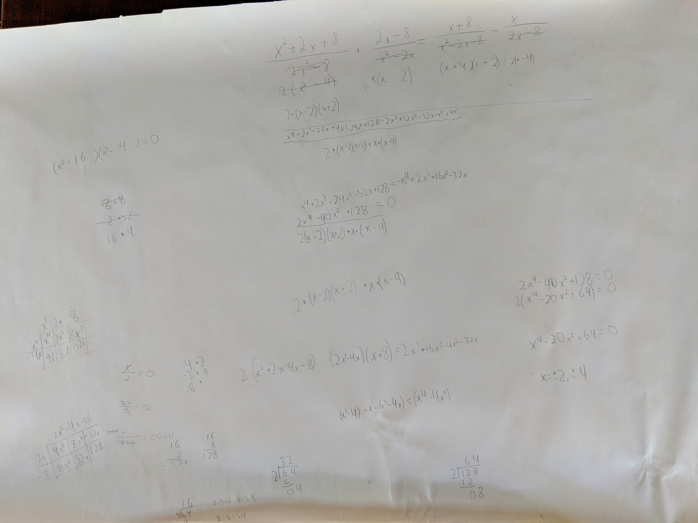</a>

While Zev’s progress was interesting, at least to me, it does not prove that *lived experience* is not a thing or that it is not a problem. Neither does just claiming that it is, however. You would need to find direct support for your assertion that also excludes alternative explanations. You would want to explain, for example, why we see so many standardized tests that show racial disparities in outcomes. Could all standardized tests accidentally select for the wrong *lived experience*? Even tests that do not require any language skills show these disparities.

I downloaded US Government data from [bls.gov](https://www.bls.gov/nls/) National Longitudinal Survey of Youth and analyzed it to see what they say about the topic. 

    
Source Code

    import matplotlib.pyplot as plt
    import pandas as pd
    import numpy as np

    bins = 20
    figsize = (15,5)
    whitecolor79 = 'orange'
    blackcolor79 = 'teal'
    whitecolor97 = 'red'
    blackcolor97 = 'blue'
    alpha = 0.5

    df1979 = pd.read_csv('data1979/default.csv', sep=',',header=0)
    df1979 = df1979.rename(
        columns = {
            'R0214700': 'Race', 
            'R0017352': 'WECHSLER_IQ_TEST', 
            'R0017337': 'DIFFERENTIAL_APTITUDE_TEST',
            'R0017312': 'CALIFORNIA_TEST_OF_MENTAL_MATURITY', 
            'R0017317': 'MNTL_ABILITY', 
            'R0017388': 'IQ_TEST_1', 
            'R0017332': 'K_A_INTLGN', 
            'R0618200': 'AFQT', 
            'R0214800': 'Sex'})

    df1997 = pd.read_csv('data1997/default.csv', sep=',',header=0)
    df1997 = df1997.rename(
        columns = {
            'R1482600': 'Race', 
            'R0536300': 'Sex', 
            'R5473600': 'PIAT_TEST_1', 
            'R7237300': 'PIAT_TEST_2',
            'S1552600': 'PIAT_TEST_3', 
            'Z9033700': 'SAT_MATH', 
            'Z9033900': 'SAT_VERBAL', 
            'Z9034100': 'ACT', 
            'R9829600': 'ASVAB'})

    graphs79 = [
        ['AFQT', '1979 Armed Forces Qualification Test', bins], 
        ['IQ_TEST_1', '1979 Various IQ Tests', bins],
        ['CALIFORNIA_TEST_OF_MENTAL_MATURITY', '1979 California Test of Mental Maturity', bins],
        ['DIFFERENTIAL_APTITUDE_TEST','1979 Differential Aptitude Test', bins],
        ['WECHSLER_IQ_TEST','1979 Wechsler IQ Test', bins]
    ]

    graphs97 = [
        ['ASVAB', '1997 Armed Services Vocational Aptitude Battery', bins], 
        ['SAT_MATH', '1997 SAT Math Test\n1: 200-300 - 2: 300-400\n3: 400-500 - 4: 500-600\n5: 600-700 - 6: 700-800', 6],
        ['SAT_VERBAL', '1997 SAT Verbal Test\n1: 200-300 - 2: 300-400\n3: 400-500 - 4: 500-600\n5: 600-700 - 6: 700-800', 6],
        ['ACT','1997 ACT Test\n1: 0-6 - 6: 30-36', 6],
        ['PIAT_TEST_1','Peabody Individual Achievement Test 2000', bins],
        ['PIAT_TEST_2','Peabody Individual Achievement Test 2001', bins]
    ]

    for i in range(5):
        fig, ax = plt.subplots(1, 2, sharex='col', sharey='row', figsize=figsize)
        q = 'Race == 3 and ' + graphs79[i][0] + ' >= 1'
        white = df1979.query(q)[[graphs79[i][0]]]
        white.hist(ax=ax[0], bins=graphs79[i][2], alpha=alpha, color=whitecolor79)
        q = 'Race == 2 and ' + graphs79[i][0] + ' >= 1'
        black=df1979.query(q)[[graphs79[i][0]]]
        black.hist(ax=ax[1], bins=graphs79[i][2], alpha=alpha, color=blackcolor79)
        ax[0].set_title(graphs79[i][1] + '\nNon-Hispanic, Non-Black')
        ax[1].set_title(graphs79[i][1] + '\nBlack')
    for i in range(6):
        fig, ax = plt.subplots(1, 2, sharex='col', sharey='row', figsize=figsize)
        q = 'Race == 4 and ' + graphs97[i][0] + ' >= 1'
        white = df1997.query(q)[[graphs97[i][0]]]
        white.hist(ax=ax[0], bins=graphs97[i][2], alpha=alpha, color=whitecolor97)
        q = 'Race == 1 and ' + graphs97[i][0] + ' >= 1'
        black = df1997.query(q)[[graphs97[i][0]]]
        black.hist(ax=ax[1], bins=graphs97[i][2], alpha=alpha, color=blackcolor97)
        ax[0].set_title(graphs97[i][1] + '\nNon-Hispanic, Non-Black')
        ax[1].set_title(graphs97[i][1] + '\nBlack')

    
Results

    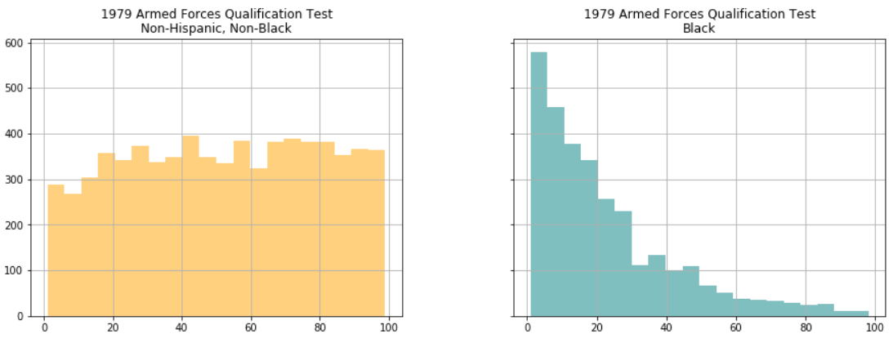
    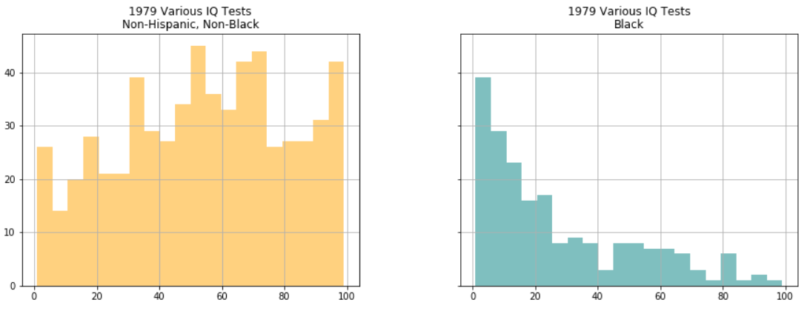
    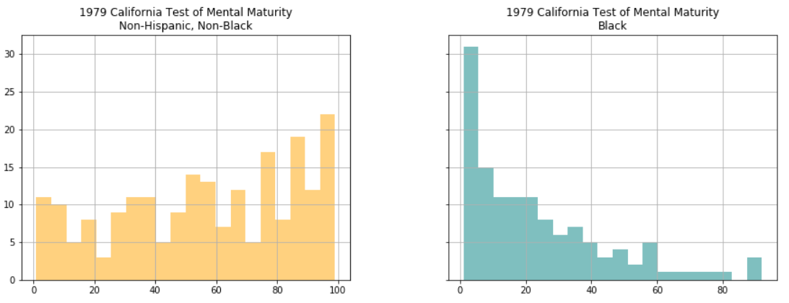
    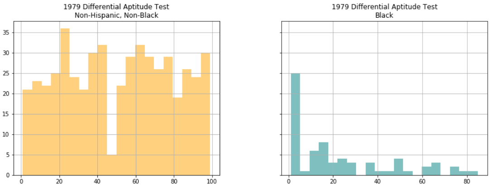
    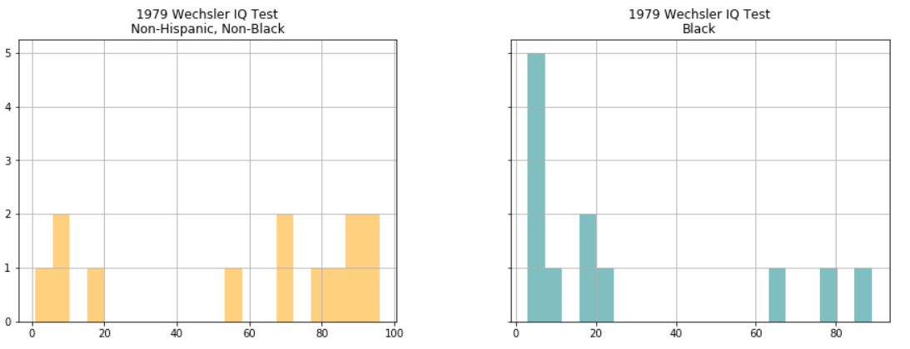
    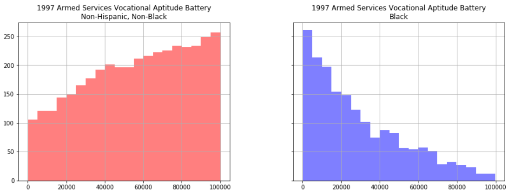
    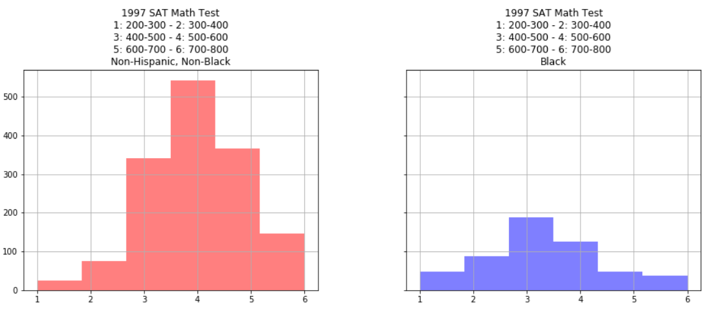
    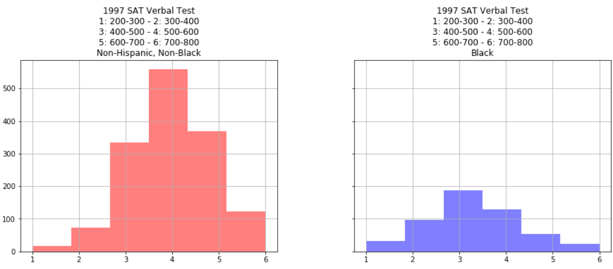
    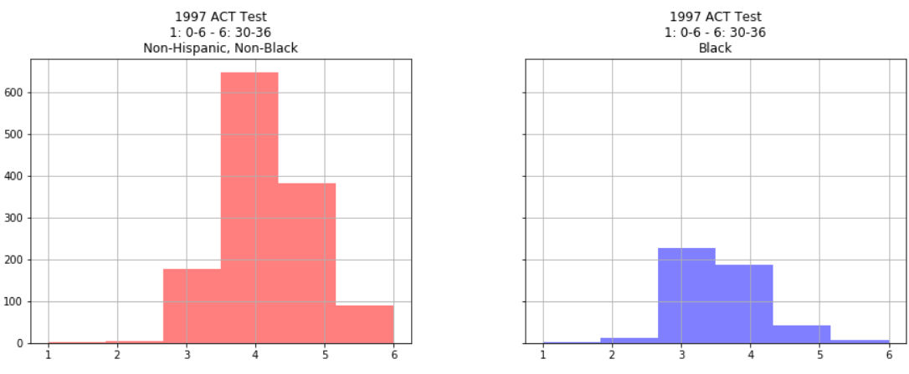
    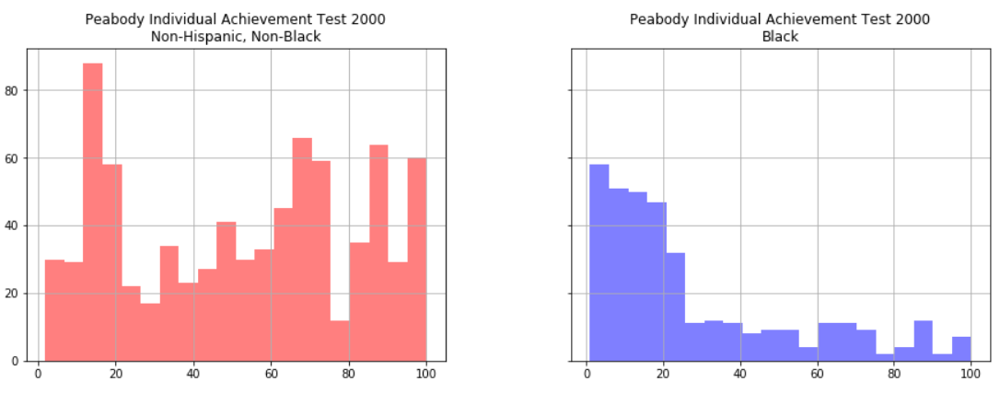
    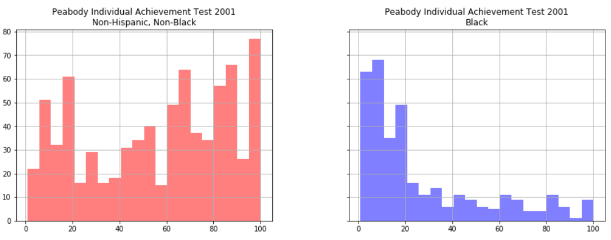                    

The data tell a consistent story that is repeated in the depressed graduation rates. So, if *lived experience* is the answer, it also has to explain ASVAB, SAT, ACT, Peabody, and IQ tests done on 20000 Americans over many decades. I’m still waiting for that to happen.

We know other things about these credentials Mr. Oakley spoke about. We know, for example, that the so-called *sheepskin effect* is strong and accounts for nearly all the value of a college education. The *sheepskin effect* is the value you get from having the degree, as opposed to just having the education that goes along with it. If the education was providing training that was paid for directly by the employer, then you would expect to get 75% of the value of your education from your employer if you received 75% of the education. That is not the case however. In the data below[^1], we see that you only receive about 20% of the value for having finished your third year of university. In fact, this remains true right up until you receive your diploma (historically written on sheepskin). The last day of class is, in a sense, worth 80% of the cost of your education.

| Data        | Ave. Year 9-11 Premium | Year 12 Premium | Ave. Year 13-15 Premium | Year 16 Premium |
|:--------------|-------------:|------:|------:|------:|------:|
| Current Population Survey 1990 | +8.0% | +18.1% | +3.9% | +26.2% |
| Current Population Survey 1991-92 | +5.5% | +17.4% | +5.9% | +39.1% |
| National Longitudinal Survey of Youth, 1993 | +6.9% | +13.0% | +7.4% | +30.1% |
| Canadian Census 1996 (males) | +3.4% | +8.9% | +3.4% | +29.8% |
| Canadian Census 1996 (females) | +5.7% | +12.3% | +5.7% | +35.9% |
| International Adult Literacy and Skills Survey 2003 | +3.4% | +27.0% | +3.4% | +58.2% |
| Current Population Survey Merged Outgoing Rotation Groups 19992003 (white males) | +3.8% | +20.5% | +6.5% | +30.4% |
| Current Population Survey Merged Outgoing Rotation Groups 19992003 (black males) | +1.2% | +16.0% | +7.8% | +23.6% |
| National Longitudinal Survey of Youth 1979-2004 (starting wages) | +2.1% | +2.6% | +2.1% | +33.2% |
| Average | +4.4% | +15.1% | +5.1% | +34.1% |
| Median | +3.8% | +16.0% | +5.7% | +30.4% |

The reason why this is so important is that signalling requires confidence. Employers need to know that the credential is actually selecting for something valuable or they will stop using it. Mr. Oakley is selecting the people who can least afford it and selling them something that is explicitly watered down in value by his actions. It is absolutely unconscionable in my opinion. We all have opinions though. Who says mine is right?







Mr. Oakley is not alone. Strange things are happening around math education in many places. Seattle public schools are making math an explicitly [ethnic course](https://www.k12.wa.us/sites/default/files/public/socialstudies/pubdocs/Math%20SDS%20ES%20Framework.pdf) of study. [Lee Ohanian at the Hoover Institute](https://www.hoover.org/research/seattle-schools-propose-teach-math-education-racist-will-california-be-far-behindseattle) wrote:

> According to Seattle educators, math instruction in the United States is an example of “Western Math,” which apparently is the appropriation of mathematical knowledge by Western cultures. While everyone agrees that two plus two is four, three times three is nine, and that there are three hundred and sixty degrees in a circle, Western Math critics worry about more nuanced issues, such as why we teach kids Western counting and not, for example, how the Aborigines count.
— <cite>Ohanian</cite>

Ohanian is wrong about at least one thing. Not everyone agrees that $2 + 2 = 4$. There is a small but growing group of people who will shout from the rafters saying that this is false and "reeks of white supremacist patriarchy". It may sound like a fringe voice, but the author of that is a math education professor from Brooklyn College. If she thinks $2 + 2 = 4$ is white supremacy it is probably not as fringe a position in the academy as we think. Mr. Oakley certainly seems to think that algebra has a certain racist component that means some people cannot learn it because of *lived experience*. Frankly, it sounds ridiculous to me.

> Freedom is the freedom to say that 2+2=4. If that is granted, all else follows
> — <cite>George Orwell, 1984</cite>

There is light at the end of this tunnel, thank goodness. The National Council of Teachers of Mathematics is engaged in a lobbying effort to [detrack math](https://www.nctm.org/News-and-Calendar/Messages-from-the-President/Archive/Robert-Q_-Berry-III/Initiating-Critical-Conversations-on-the-Discontinuation-of-Tracking/). Detracking is literally putting all students of the same age into the same classroom. Apparently, ***math teachers*** they think everyone can learn ***math*** at the same rate. I guess that means none of us will be taking that intermediate algebra class for much longer.

Your obedient servant,

[^1]: *The Case against Education* by Bryan Caplan

