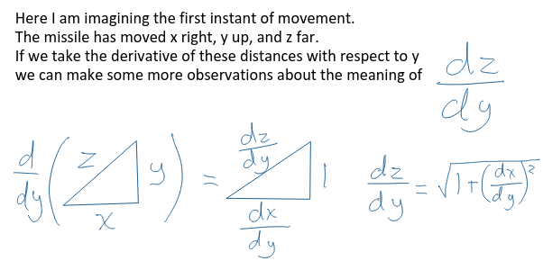
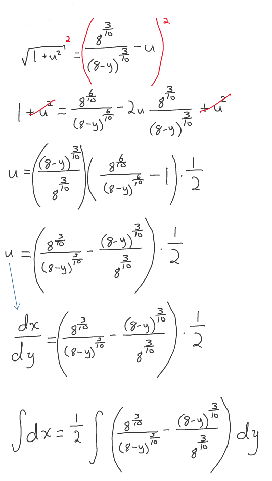
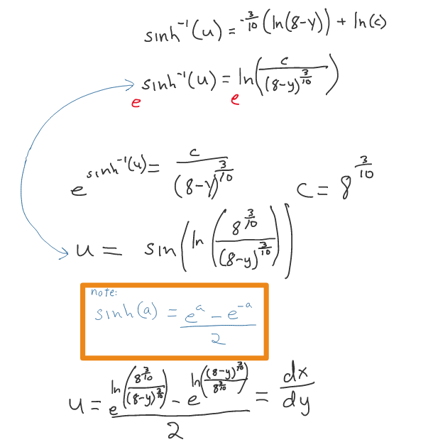
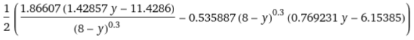
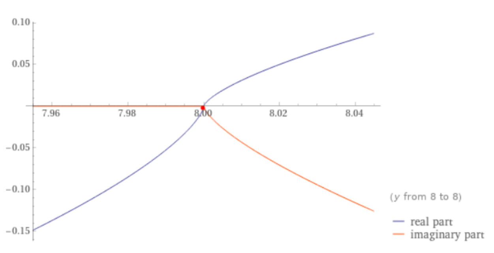

+++
fragment = "content"
categories = ["Math", "Math For Fun", "Calculus"]
title = "Pursuit Curves"
display_date = true
date = "2021-01-11"
weight= 100
katex = true

summary = """

A colleague of mine presented math puzzle today on a Slack channel I moderate.

It is a fun one!

There is an airplane eight miles directly above a surface to air missile, which is fired at that moment...

"""

[sidebar]
  align = "right"

[asset]
  image = "anim.gif"

+++

* There is an airplane eight miles directly above a surface to air missile, which is fired at that moment.

  * At all times, the airplane travels in a straight direction.
  * The airplane travels at 600 miles per hour.
  * The missile travels at 2000 miles per hour.
  * The missile always travels at an angle that directly faces the airplane.

* Questions:
  * How far will the plane travel before struck by the missile?
  * How long will it take for the missile to strike the plane?
  * How long is the flight path of the missile?

It seems obvious that I need to construct some equations to integrate over time in order to account for the movement of missile. Most importantly, the change of angle over time.

### Layout the basics

<div class="float-right">

</div>

I started with a sketch:

$\theta = \arctan(\cfrac{8-y}{600t-x})$

$\cos(\theta) = \cfrac{1}{\sqrt{1 + \cfrac{(8-y)^2}{(600t-x)^2}}}$

$\sin(\theta) = \cfrac{8-y}{(600t - x)\sqrt{1 + \cfrac{(8-y)^2}{(600t-x)^2}}}$

|Derivatives|Description|
|:--|:-|
|$\frac{dz}{dt} = 2000 km/h$ | The missile's total speed.|
|$\frac{dx}{dt} = 2000*\cos(\theta) km/h$ | The missile's horizontal speed.|
|$\frac{dy}{dt} = 2000*\sin(\theta) km/h$ | The missile's vertical speed.|
|$\frac{dx}{dt} * \frac{dt}{dy} = \frac{dx}{dy}$ | Do arithmetic with above values.|
|$\frac{dx}{dy} = \cfrac{600t - x}{8-y}$ | Rate of change of horizontal / vertical speed.|
|$\frac{dz}{dy} = \sqrt{1 + (\frac{dx}{dy})^2}$ |  |

### Begin to solve

At present to have too many variables. Let's see if we can simplify the problem.

$$\frac{dx}{dy} = \cfrac{600t - x}{8-y}$$

We can take the derivative with respect to $y$ of the equation above.

$$\frac{d}{dy}(\frac{(8-y)dx}{dy} = 600t - x)$$

With the product rule we find:

$$(8-y)\frac{dx^2}{d^2y} = 600\cfrac{dt}{dy}$$

Let's substitute $\cfrac{dt}{dy}$ out with $\cfrac{dt}{dz} * \cfrac{dz}{dy} = \cfrac{\sqrt{1 + (\frac{dx}{dy})^2}}{2000}$ from our table above.

$$(8-y)\frac{dx^2}{d^2y} = 600\cfrac{\sqrt{1 + (\frac{dx}{dy})^2}}{2000}$$

let $u = \frac{dx}{dy}$ and substitute

$$(8-y)\frac{du}{dy} = \frac{3}{10} \sqrt{1 + u^2}$$

This can be written as a separable differential equation.

### Alternative Solution 1

$$\int{\frac{1}{\sqrt{1 + u^2}} du} = \frac{3}{10} \int{\cfrac{1}{8-y}dy}$$

This can be solved directly.

$$\ln{(\sqrt{1 + u^2} + u)} = \frac{-3}{10} \ln{(8-y)} + \ln{(c)}$$

We cheated here a a bit and set our constant as $\ln{c}$ instead of $c$ to take advantage of some log rules later.

Exponentiating both sides we get:

$$e^{\ln{(\sqrt{1 + u^2} + u)}} = e^{\frac{-3}{10} \ln{(8-y)} + \ln{(c)}}$$

$$\sqrt{1 + u^2} + u = \cfrac{c}{(8-y)^\frac{3}{10}}$$

At $t=0$, the missile is pointing up so $dx = 0$ thus $u = 0$, $y = 0$ as well (missile on ground):

$$c = 8^\frac{3}{10}$$

With so much latex to write, let me copy the strokes from my OneNote:

### Long calculations



This yields us a final function of:

$$x = \frac{1}{2} (8^{\frac{3}{10}}(-\frac{(8-y)^{\frac{7}{10}}}{\frac{7}{10}}) + \frac{(8-y)^{\frac{13}{10}}}{\frac{13}{10}(8^{\frac{3}{10}})}) + k$$

$k$ is our new constant to solve for.

At $t=0$, $x = 0$ & $y = 0$ thus $k = 2.64$

### Alternative Solution 2

$$\int{\frac{1}{\sqrt{1 + u^2}} du} = \frac{3}{10} \int{\cfrac{1}{8-y}dy}$$

In this path we observe that the left side of the integral can be expressed as the inverse hyperbolic sine.



This yields us a final integral that is a bit different looking but obviously goes to the same values.

$$\int{dx} = \int{e^{\ln{(\frac{8^{\frac{3}{10}}}{(8-y)^{\frac{3}{10}}})}} - e^{\ln{(\frac{(8-y)^{\frac{3}{10}}}{8^{\frac{3}{10}}})}}dy}$$

While complex looking it yields a direct answer in Wolfram Alpha

$x =$  $+ k$

$k$ is our new constant to solve for.

At $t=0$, $x = 0$ & $y = 0$ thus $k = 2.64$

As we can see, when $y$ approaches $8$ from the left, the right side expressions approaches $\frac{0}{0}$. So, this solution has no answer at collision time, though it is fair to say the missile hits the plane.



## Analytical Solution

When $y = 8$, $x$ is the distance the plane traveled at collision time.

We plug $y = 8$ in above and solve for $x$.

$$x = 2.64km$$

The time is:

$$t = \frac{2.64km}{600\frac{km}{h}} = 0.0044h = 15.84s$$

The missile traveled:

$$2000\frac{km}{h} * 0.0044h = 8.8km$$

## Numerical solution provided by my colleague Jeremy

My colleague Jeremy builds a tool called [wasora](https://github.com/seamplex/wasora). He wrote the script below to calculate the values for this problem numerically and generated the gif above. This tool is cool!

```bash
dt = 1e-5
end_time = 20
# problem parameters
h0 = 8           # plane height [miles]
vp = 600/3600    # plane speed [miles/second]
vm = 2000/3600   # missile speed [miles/second]
PHASE_SPACE xp yp theta xm ym s
# non-zero initial conditions
yp_0 = h0
theta_0 = pi/2
# DAE system
xp_dot .= vp
yp_dot .= 0
theta .= atan2(yp-ym, xp-xm)
xm_dot .= vm*cos(theta)
ym_dot .= vm*sin(theta)
s_dot .= sqrt(xm_dot^2+ym_dot^2)
# output
PRINT %.8f t xp yp xm ym theta s %e ((xm-xp)^2+(ym-yp)^2) 
# termination condition
done = ((xm-xp)^2+(ym-yp)^2)<1e-12
IF done
 PRINT "\#   distance the plane traveled: " xp "miles"
 PRINT "\#                time to impact: " t  "seconds"
 PRINT "\# distance the missile traveled: " s  "miles"
ENDIF 
```
