+++
fragment = "content"
# categories = ["Philosophy", "Math", "Education"]
title = "Is Math Racist?"
display_date = true
date = "2020-11-29"
weight= 100
katex = true

summary = """

After listening to an astounding [NPR story](https://www.npr.org/2017/07/19/538092649/say-goodbye-to-x-y-should-community-colleges-abolish-algebra) about California community colleges dropping its intermediate algebra requirement because of racial differences in success in the class, I decided I would see if I could teach my son algebra. He had just finished the first grade. Let's see what, if anything, that experience taught me about math and racism.

"""

[sidebar]
  align = "right"

[asset]
  image = "math1.jpg"

+++

To set the stage for this story, we need to travel back to May, 2017. My son, Zev, had just finished 1st grade. He was enrolled at “the best” public elementary school in the city. I assumed he would be getting a decent education; not that I really know what that means. When he finished 1st grade only having progressed to addition of single digit numbers I was disappointed. My first grade teacher, Mrs. Larabee, demanded mastery of the times tables to advance to the second grade. Channeling my inner Mrs. Larabee, I decided it was time for me to take a more active role in Zev’s education. We studied time tables for a couple weeks and while he had not yet memorized them, he did memorize all the squares $x^2\ ∣{12 \atop 0}$ so he could calculate any value in the table with addition in a few moments.



This was a good start. Rote memory tasks suck though. So, I made certain to provide motivation for this continued effort by giving him ways to apply his new multiplication skills. By June, he was rocking long multiplication. It became clear that school was not optimizing for Zev’s preferred pace. I showed him long division, one June day, so he could see the multiplication procedure was reversible (more motivation). I recall saying, “We will work on this next summer.”

When I came home from work two days hence this sign was waiting for me.

> To: Dad - Division by next summer pretty pleze — <cite>Zev ☺</cite>

---

On July 19th, 2017 (5 weeks after the happy note was posted on the fence) I was listening to NPR's afternoon show, *All Things Considered*. They were running a [story](https://www.npr.org/2017/07/19/538092649/say-goodbye-to-x-y-should-community-colleges-abolish-algebra) about California community colleges dropping their intermediate algebra requirement. Ostensibly, the reason they were removing this requirement was to increase graduation rates. The Chancellor, Eloy Ortiz Oakley, went on to observe that there were racial differences in success in algebra. He went to great pains to ensure the listener that this was not caused by a cognitive deficit. Rather, it is just that algebra is not part of the *lived experience* of the people who do not pass.

> this economy — which is unforgiving of those students who don't have a credential — the biggest barrier for them is this algebra requirement. It's what has kept them from achieving a credential — <cite>Oakley</cite>

The solution was clear to him, remove the offending requirement and graduation rates would go up. He recognized that there was a signalling component to these credentials because he reminded us that the new formulation was “just as rigorous”. When asked if he was just taking the easy way out by removing the challenge from the curriculum he said, “nothing could be further from the truth.”

He was right about that part, at least. *Nothing could be further from the truth.* Removing challenging topics from the curriculum is the easy way out. Obviously. His repeated attempts to bulwark the position suggested to me that even he did not believe it.

> The lady doth protest too much, methinks — <cite>Queen Gertrude, Hamlet</cite>

---

My immediate response to this story was despair. Apparently, educators had lost the plot.

One purpose of a college diploma is to show that the recipient has received a base level of instruction and has shown mastery in the topics. It is not so different from the sport analogy of varsity vs junior varsity except in the realm of education. College is the varsity learning team. It is supposed to be hard. It is supposed to select for a particular group of talents NOT equally distributed among all members of the community. We should not be surprised that some people fail to succeed. Furthermore, it should surprise no one that some people are better at this particular human endeavor than others. Varsity basketball teams are not like that the average student in the school. They are taller, more athletic, and more interested in team activities. Likewise you would not expect the varsity learning team to be just like the average person in town. You certainly could not guess *a priori* who would be on the varsity learning team, but it also does not matter in the slightest. The purpose of a diploma is to convey who made the grade. It is an objective measurement of a collection of talents graduates actually express in their lives. Only a fraction of the talents required to get a college diploma are required to pass algebra, but those talents are, or at least were, considered important to the successful college experience.

We should also be clear about this. ***There is nothing particularly special about this talent for higher education.*** There is an endless list of domains for humans to show mastery in. None are necessarily better than any other. The relative value of these talents change over time, geography, and circumstance. It is not obvious that talent in any specific domain would be shared evenly among people of different cultures or lineages. In fact, evolution being the driver of speciation suggests strongly that people having different talents, in conjunction with different circumstances, would drive changes in populations over time. You really should assume differences in any heritable traits between different lineages unless the selection pressures are equal everywhere.




[Tang, Peng, Wang et al.](https://pubmed.ncbi.nlm.nih.gov/18292342/), have *observed a pattern of ancestral allele frequency distributions that reflects variation in population dynamics among geographic regions* [^1]. People whose ancestors came from the same geographical area are genetically more similar to each other than they are to people from other geographical areas. The second image shows the genetic distance of each person in the study relative to the others [^2].

> The graphic combines combines 938 vertical lines, one for each person in the sample. Each line is partitioned into segments with lengths that correspond to that persons ancestry coefficients. When only one pattern is represented, the individual belongs entirely to that cluster as in large portions of the lines for Africa, Europe, East Asia, and the Americas. In contrast, look at the Mideast segment of the figure. Interpreted colloquially (remember that the labels for the clusters were added only after each individuals ancestry had been estimated), most of the lines have a mix of Mideastern, European, and Central or South Asian ancestry. — <cite>Charles Murray, Human Diversity</cite>

Why then, are college administrators so troubled by aggregate differences in outcomes based on race? You certainly would expect to see racial differences. You could not guess in advance what they would be, but certainly you would expect to see differences in the aggregate. You would also expect that *whatever differences you observe between races would be smaller than differences you observe within races*. This is because we are vastly more similar than we are different. Races are an artifact of geographic isolation over tens of thousands of years of evolution which is a drop in the bucket of our total evolution. As such, we are far more similar than we are different. That does not mean however that there could not be small but measurable differences between races in any arbitrary measure. This is not a value judgement. Whatever differences we observe are not normative. Just like a clover with four leaves is not *the moral superior* to an exemplar with three leaves.

One of the things so peculiar about this invidious ideology is that college administrators are measuring for differences between races precisely because they know they can expect to see them and simultaneously refuse to accept the differences their measurements observe. The cognitive dissonance must be very unpleasant for them.

This refusal by college administrators to acknowledge that differences will exist creates the need to react when they find them. They feign shock that a difference can be measured. They assure us, absent evidence, that the these measured differences are the product of some odious plot rather than just some meaningless artifact. You would think the presumption would be that small differences are expected and are neither interesting, nor actionable. Instead, they feel the need to problematize some differences (but not others) and to intervene to make some disappear. Their motivations are not obvious, but they do seem to be intervening because they think the difference implies a moral shortcoming rather than one of no particular interest. It is not clear to me who they think is morally encumbered by these differences but they are intolerable to them regardless. If you were to tell me that Jews were underrepresented among stevedores, or were on average worse at analogies on SAT tests than some other group it would be as meaningless to me as the relative pork consumption among them and those groups who best them at moving containers and analogizing.

Mr. Oakley cannot accept that the average differences might be natural artifacts and in any event of no particular import. He correctly observes that it is not totally the fault of the students. There is, no doubt, occasionally some blame to lay at there feet. For example, are the failing students putting in the same amount of effort as the successful ones? Should they not be putting in even more effort than the ones who, because of their (undeserved) natural talent, do not need to work as hard to succeed? Mr. Oakley is rightly disinclined to blame the professors for their inability to get these ideas across in equal measure. But since he needs to *do something*, he blames the math.

He believes algebra is not applicable to the *lived experience* of students who are poor or not white. To salve his cognitive dissonance, he has invented a world where there exists “alternative math pathways just as rigorous” as algebra that any student can pass. I do not dispute they have identified classes that everyone can pass, I just doubt they have done so without increasing the average grade in these classes. I have not seen the data (though I have looked for it) but I suspect we will find more people passing rather than different people passing. That would mean it is less rigorous, by definition. And recall, his goal is to *increase graduation rates*, not change the demographics of graduates.

> From the fact that people are very different it follows that, if we treat them equally, the result must be inequality in their actual position, and that the only way to place them in an equal position would be to treat them differently. Equality before the law and material equality are therefore not only different but are in conflict with each other; and we can achieve either one or the other, but not both at the same time ― <cite>Friedrich von Hayek, The Constitution Of Liberty</cite>

---





So, what about this *lived experience* stuff. Does that make a difference? Can someone just as talented but with different *lived experiences* from white college students really have different capabilities as he suggests? I decided to test this assertion using my son. Could I teach a 7 year old algebra? No one could assert he has the same *lived experience* as white college student, right?

It turns out that I could. In fact, it was easy. We started with the basics of variables and doing operations on both sides of the equation. It became immediately apparent that he needed to learn fractions as well. So, that got tossed into our *alternative math pathway*. Zev took to all the symbols and logic like a duck to water. He never once complained that his *lived experience* made him incapable of learning these topics. And just so we are clear, I am no expert at either math or teaching. In fact, I am a high school drop out.

My son and I are both gifted with an abundance of cognitive capacity (measured by things like IQ tests and standardized test scores). These particular talents ***DO NOT*** make us better people. They do not make us nicer people. In fact, neither of us have an affinity for making friends (something that will not shock some readers). These skills, at best, give us an advantage learning complex and abstract ideas. Surely these skills are a handy in certain circumstances, but they are of no moral value. I am not proud of the talents we possess. We did nothing to earn them. They are just the luck of draw. In so far as we can reasonably be prideful of them, it would be in their application.

Zev applied this talents toward his math studies though, and his progress was impressive.

---

By December 31, 2017 he was able to do legit algebra 2 problems. This was only 5 months after I heard the NPR story and 7 months after he was first introduced to multiplication.

$$\cfrac{x^2+2x+8}{2x^2-8} + \cfrac{2x-8}{x^2-2x} = \cfrac{x+8}{x^2-2x-8} + \cfrac{x}{2x-8}$$

<a href="algebra3.jpg">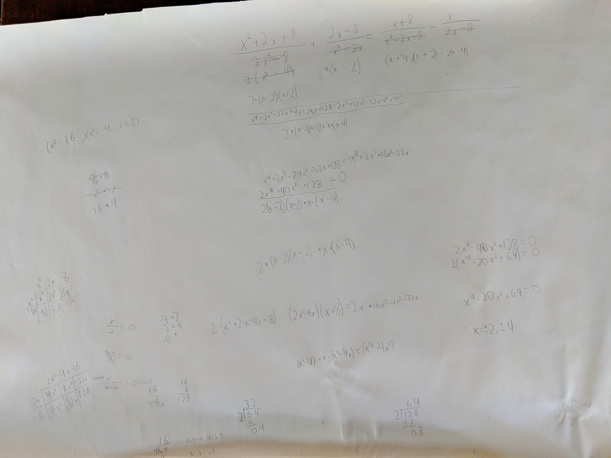</a>

---

While Zev’s progress was interesting, at least to me, it does not prove that *lived experience* is not a thing or that it is not a problem. Neither does just claiming that it is, however. You would need to find direct support for your assertion that also excludes alternative explanations. You would want to look at a broad collection of cognitive measures that show no disparities or, if they all show disparities you would expect them to point in random directions. There are datasets with these types of data. I took the time to look at them.

I downloaded US Government data from [bls.gov](https://www.bls.gov/nls/) National Longitudinal Survey of Youth and analyzed it to see what they say about the topic.

    
Source Code

    import matplotlib.pyplot as plt
    import pandas as pd
    import numpy as np

    bins = 20
    figsize = (15,5)
    whitecolor79 = 'orange'
    blackcolor79 = 'teal'
    whitecolor97 = 'red'
    blackcolor97 = 'blue'
    alpha = 0.5

    df1979 = pd.read_csv('data1979/default.csv', sep=',',header=0)
    df1979 = df1979.rename(
        columns = {
            'R0214700': 'Race', 
            'R0017352': 'WECHSLER_IQ_TEST', 
            'R0017337': 'DIFFERENTIAL_APTITUDE_TEST',
            'R0017312': 'CALIFORNIA_TEST_OF_MENTAL_MATURITY', 
            'R0017317': 'MNTL_ABILITY', 
            'R0017388': 'IQ_TEST_1', 
            'R0017332': 'K_A_INTLGN', 
            'R0618200': 'AFQT', 
            'R0214800': 'Sex'})

    df1997 = pd.read_csv('data1997/default.csv', sep=',',header=0)
    df1997 = df1997.rename(
        columns = {
            'R1482600': 'Race', 
            'R0536300': 'Sex', 
            'R5473600': 'PIAT_TEST_1', 
            'R7237300': 'PIAT_TEST_2',
            'S1552600': 'PIAT_TEST_3', 
            'Z9033700': 'SAT_MATH', 
            'Z9033900': 'SAT_VERBAL', 
            'Z9034100': 'ACT', 
            'R9829600': 'ASVAB'})

    graphs79 = [
        ['AFQT', '1979 Armed Forces Qualification Test', bins], 
        ['IQ_TEST_1', '1979 Various IQ Tests', bins],
        ['CALIFORNIA_TEST_OF_MENTAL_MATURITY', '1979 California Test of Mental Maturity', bins],
        ['DIFFERENTIAL_APTITUDE_TEST','1979 Differential Aptitude Test', bins],
        ['WECHSLER_IQ_TEST','1979 Wechsler IQ Test', bins]
    ]

    graphs97 = [
        ['ASVAB', '1997 Armed Services Vocational Aptitude Battery', bins], 
        ['SAT_MATH', '1997 SAT Math Test\n1: 200-300 - 2: 300-400\n3: 400-500 - 4: 500-600\n5: 600-700 - 6: 700-800', 6],
        ['SAT_VERBAL', '1997 SAT Verbal Test\n1: 200-300 - 2: 300-400\n3: 400-500 - 4: 500-600\n5: 600-700 - 6: 700-800', 6],
        ['ACT','1997 ACT Test\n1: 0-6 - 6: 30-36', 6],
        ['PIAT_TEST_1','Peabody Individual Achievement Test 2000', bins],
        ['PIAT_TEST_2','Peabody Individual Achievement Test 2001', bins]
    ]

    for i in range(5):
        fig, ax = plt.subplots(1, 2, sharex='col', sharey='row', figsize=figsize)
        q = 'Race == 3 and ' + graphs79[i][0] + ' >= 1'
        white = df1979.query(q)[[graphs79[i][0]]]
        white.hist(ax=ax[0], bins=graphs79[i][2], alpha=alpha, color=whitecolor79)
        q = 'Race == 2 and ' + graphs79[i][0] + ' >= 1'
        black=df1979.query(q)[[graphs79[i][0]]]
        black.hist(ax=ax[1], bins=graphs79[i][2], alpha=alpha, color=blackcolor79)
        ax[0].set_title(graphs79[i][1] + '\nNon-Hispanic, Non-Black')
        ax[1].set_title(graphs79[i][1] + '\nBlack')
    for i in range(6):
        fig, ax = plt.subplots(1, 2, sharex='col', sharey='row', figsize=figsize)
        q = 'Race == 4 and ' + graphs97[i][0] + ' >= 1'
        white = df1997.query(q)[[graphs97[i][0]]]
        white.hist(ax=ax[0], bins=graphs97[i][2], alpha=alpha, color=whitecolor97)
        q = 'Race == 1 and ' + graphs97[i][0] + ' >= 1'
        black = df1997.query(q)[[graphs97[i][0]]]
        black.hist(ax=ax[1], bins=graphs97[i][2], alpha=alpha, color=blackcolor97)
        ax[0].set_title(graphs97[i][1] + '\nNon-Hispanic, Non-Black')
        ax[1].set_title(graphs97[i][1] + '\nBlack')

    
Results

    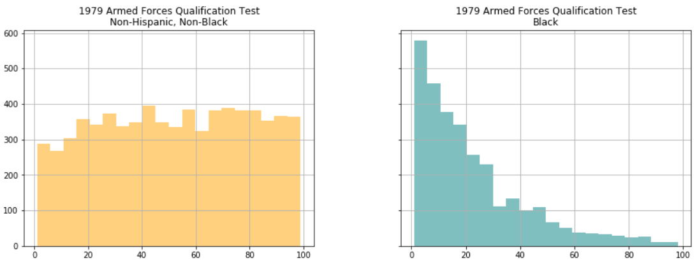
    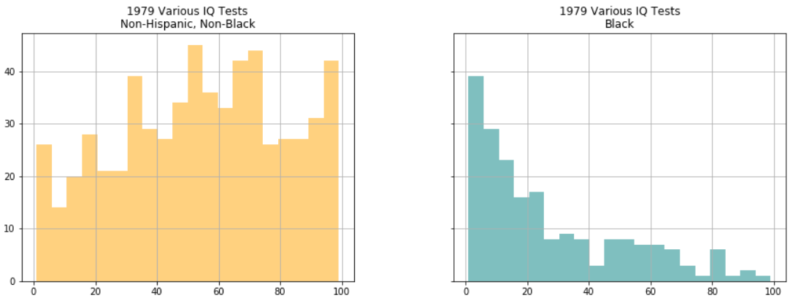
    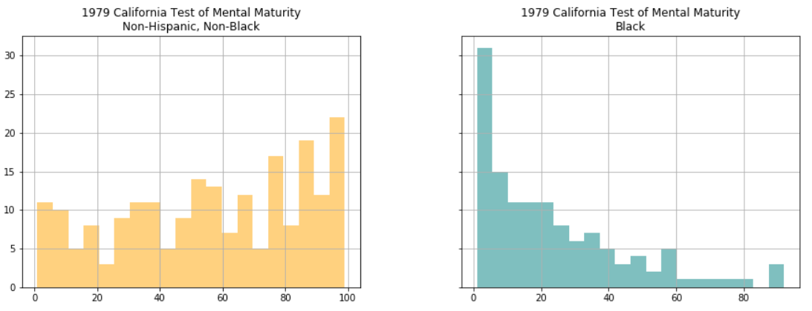
    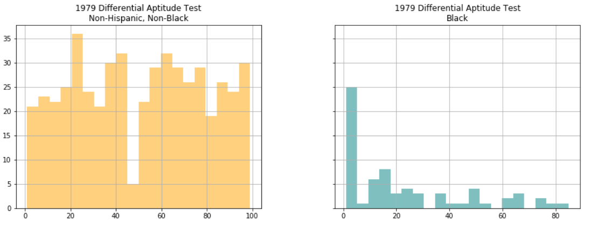
    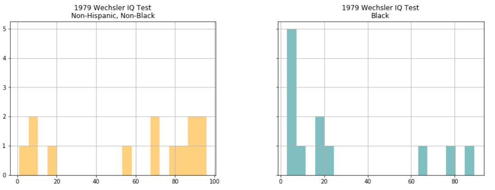
    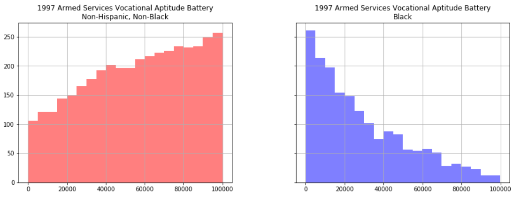
    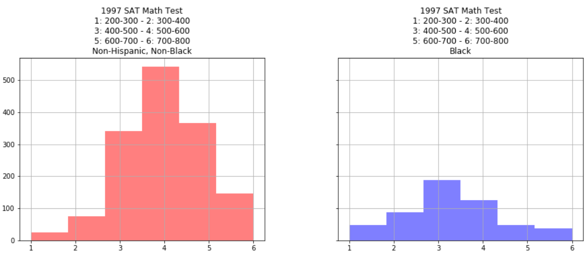
    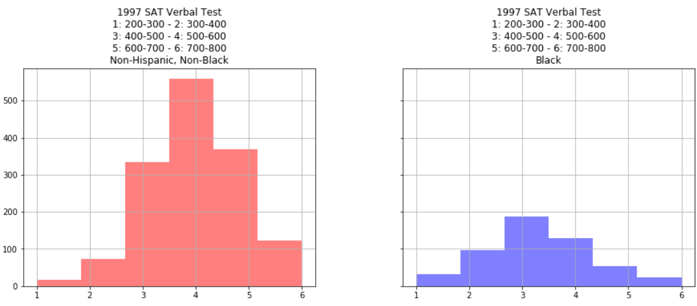
    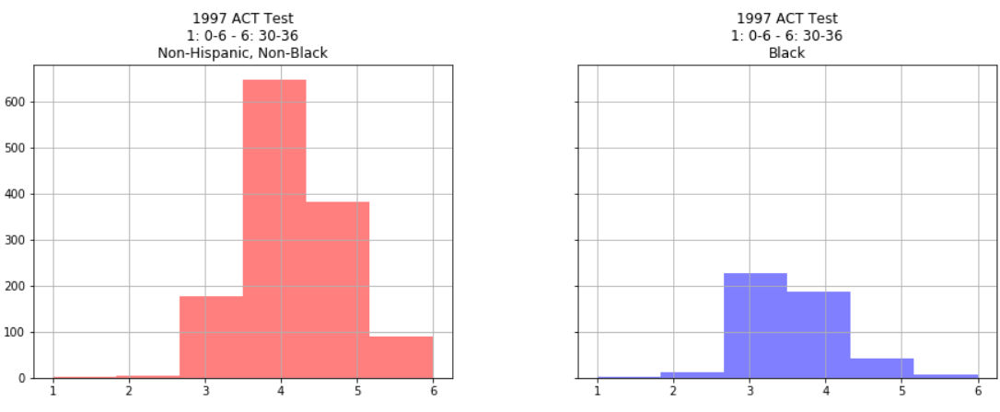
    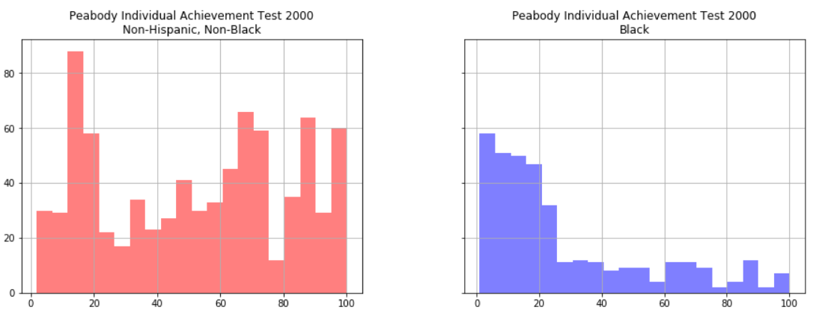
    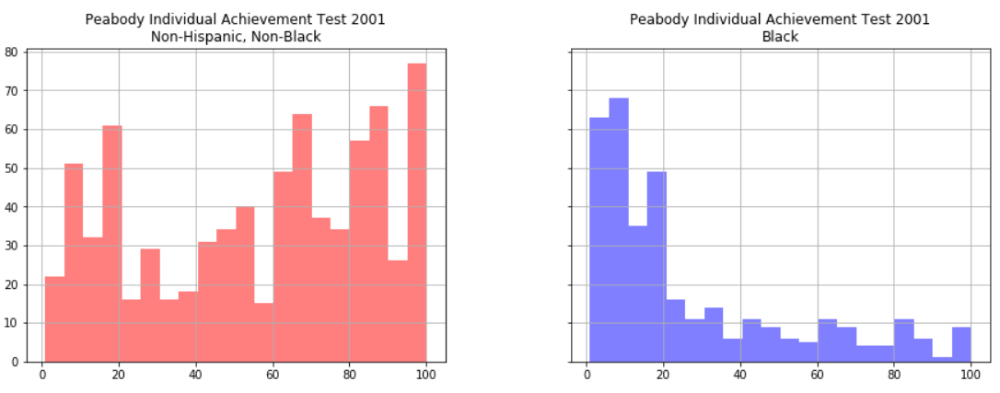

The data tell a consistent story that is repeated in the depressed graduation rates. Could all standardized tests accidentally select for the wrong *lived experience*? If *lived experience* is the answer, it also has to explain ASVAB, SAT, ACT, Peabody, and IQ tests done on 20000 Americans over many decades.

---

We know other things about these credentials (college diplomas) Mr. Oakley spoke about. We know, for example, that the so-called *sheepskin effect* is strong and accounts for nearly all the value of a college education. The *sheepskin effect* is the value you get from having the degree, as opposed to just having the education that goes along with it. If the education was providing training that was paid for by the employer in proportion to the amount of education gained, that would confirm the *human capital* hypothesis. This hypothesis states that education makes people more valuable and the more they know the more they earn. That is not the case however. In the data below[^3], we see that you only receive about 20% of the value for having finished your third year of university. In fact, this remains true right up until you receive your diploma (historically written on sheepskin). The last day of class is, in a sense, worth 80% of the cost of your education.

| Data        | Ave. Year 9-11 Premium | Year 12 Premium | Ave. Year 13-15 Premium | Year 16 Premium |
|:--------------|-------------:|------:|------:|------:|------:|
| Current Population Survey 1990 | +8.0% | +18.1% | +3.9% | +26.2% |
| Current Population Survey 1991-92 | +5.5% | +17.4% | +5.9% | +39.1% |
| National Longitudinal Survey of Youth, 1993 | +6.9% | +13.0% | +7.4% | +30.1% |
| Canadian Census 1996 (males) | +3.4% | +8.9% | +3.4% | +29.8% |
| Canadian Census 1996 (females) | +5.7% | +12.3% | +5.7% | +35.9% |
| International Adult Literacy and Skills Survey 2003 | +3.4% | +27.0% | +3.4% | +58.2% |
| Current Population Survey Merged Outgoing Rotation Groups 19992003 (white males) | +3.8% | +20.5% | +6.5% | +30.4% |
| Current Population Survey Merged Outgoing Rotation Groups 19992003 (black males) | +1.2% | +16.0% | +7.8% | +23.6% |
| National Longitudinal Survey of Youth 1979-2004 (starting wages) | +2.1% | +2.6% | +2.1% | +33.2% |
| Average | +4.4% | +15.1% | +5.1% | +34.1% |
| Median | +3.8% | +16.0% | +5.7% | +30.4% |

The reason why this is so important is that the signalling the diploma conveys requires confidence in the signalled. Employers need to know that the credential is actually selecting for something valuable or they will eventually stop using it. Mr. Oakley is selecting the people who can least afford it and selling them something that is explicitly watered down in value by his actions. If the diploma costs the same but is worth less because it is no longer as selective you are stealing, not only from new graduates, but also from former graduates who did pass the more rigorous standards at great expense but no longer get to take credit for it. This is unconscionable in my opinion. We all have opinions though...

---







Mr. Oakley is not alone. Strange things are happening around math education in many places. Seattle public schools are making math an explicitly [ethnic course](https://www.k12.wa.us/sites/default/files/public/socialstudies/pubdocs/Math%20SDS%20ES%20Framework.pdf) of study. [Lee Ohanian at the Hoover Institute](https://www.hoover.org/research/seattle-schools-propose-teach-math-education-racist-will-california-be-far-behindseattle) wrote:

> According to Seattle educators, math instruction in the United States is an example of “Western Math,” which apparently is the appropriation of mathematical knowledge by Western cultures. While everyone agrees that two plus two is four, three times three is nine, and that there are three hundred and sixty degrees in a circle, Western Math critics worry about more nuanced issues, such as why we teach kids Western counting and not, for example, how the Aborigines count. — <cite>Ohanian</cite>

Ohanian is wrong about at least one thing. Not everyone agrees that $2 + 2 = 4$. There is a small but growing group of people who will shout from the rafters saying that this is false and "reeks of white supremacist patriarchy". It may sound like a fringe voice, but the author of that is a math education professor from Brooklyn College. If she thinks this, and is willing to say it in public, it is probably not as fringe a position in the academy as we might think. While Mr. Oakley does not use the explicit words, he certainly seems to think that algebra has certain components that means some people cannot learn it because of *lived experience*. Recall it was he who points out the racial disparities.

There is light at the end of this tunnel. The National Council of Teachers of Mathematics is engaged in a lobbying effort to [detrack math](https://www.nctm.org/News-and-Calendar/Messages-from-the-President/Archive/Robert-Q_-Berry-III/Initiating-Critical-Conversations-on-the-Discontinuation-of-Tracking/). Detracking is literally putting all students of the same age into the same classroom. Apparently, ***math teachers*** think everyone can learn math at the same rate. Does this mean we will all be doing calculus at age 9 like Zev or that none of us will be taking intermediate algebra class, even in college?

---

Your obedient servant,

[^1]: This interpretation of ancestry coefficients, expressed as percentage of ancestry, follows the usage in Li, Absher, Tang et al. (2008) and in the article that fully explains the Frappe software. The measure is created by a vector of scores. Each score corresponds to the probability that a randomly sampled allele from individual i originates from a specific ancestral population, k. Tang, Peng, Wang et al. (2005): 290.

[^2]: The plot is based on the value of a statistic, FST, discussed in note 4 of the introduction to Part II. It measures population differentiation due to genetic structure for each pair of individuals in the sample. It is one of the most widely used statistics in population genetics. The team conducted a principal component factor analysis on the FST matrix. Such an analysis takes a set of correlated observations in this case, the 938-by-938 matrix of FST values and creates a smaller number of uncorrelated variables, which are called the principal components (PCs). Colloquially: The programs algorithms create a first component that explains as much of the variation among the observations as possible. It then creates a second component that explains as much of the remaining variation as it can, subject to the restriction that the second component must be uncorrelated with the first component and so on through successive PCs until all of the variation has been explained. In the Li study, the first and second PCs explained 52 percent and 28 percent of the FST respectively, for a total of 80 percent. The first PC primarily described the contrast between sub-Saharan Africans and non-Africans, and the second PC primarily described the differences among the populations in Eurasia.

[^3]: *The Case against Education* by Bryan Caplan
